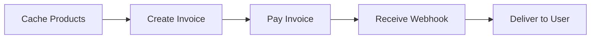

Fetch the complete documentation index at: https://docs.bitrefill.com/llms.txt. Use this file to discover all available pages before exploring further. Append .md to any documentation page URL to get its markdown version.

# Resell Bitrefill Products

Standard integration pattern for B2B partners.

This guide describes the standard integration flow for B2B partners. Follow these steps to build a robust integration with Bitrefill.

## Overview

A typical integration involves five steps:



1. **Cache the product catalog** — Fetch and store products locally
2. **Create an invoice** — When a user wants to purchase
3. **Pay the invoice** — Via balance or crypto
4. **Receive webhook** — Get notified when delivery completes
5. **Deliver to user** — Provide the gift card code

## Step 1: Cache the Product Catalog

Fetch the full product catalog and cache it locally. This avoids making product requests for every user interaction.

```javascript
async function fetchAllProducts() {
  const products = [];
  let url = `${BASE_URL}/products?limit=50`;
  
  while (url) {
    const response = await fetch(url, { headers });
    const data = await response.json();
    products.push(...data.data);
    url = data.meta._next || null;
  }
  
  return products;
}
```

### Refresh Frequency

Refresh your product cache regularly:

* **Minimum**: Daily
* **Recommended**: Every few hours
* **Best**: Hourly or more frequently

Products can go out of stock or have issues. Stale data leads to failed orders.

<Callout theme="warning">
  Always check product availability before creating invoices. An out-of-stock product will return an error.
</Callout>

### What to Cache

For each product, store:

| Field      | Purpose                               |
| ---------- | ------------------------------------- |
| `id`       | Product identifier for invoices       |
| `name`     | Display name                          |
| `packages` | Fixed denominations with `package_id` |
| `range`    | Flexible value range (min/max/step)   |
| `country`  | Filter by region                      |
| `currency` | Product denomination currency         |
| `in_stock` | Availability status                   |

## Step 2: Create an Invoice

When a user wants to purchase, create an invoice:

```javascript
const response = await fetch(`${BASE_URL}/invoices`, {
  method: 'POST',
  headers,
  body: JSON.stringify({
    products: [{
      product_id: 'amazon-us',
      package_id: 'amazon-us<&>50',
      quantity: 1
    }],
    payment_method: 'balance',
    webhook_url: 'https://your-server.com/bitrefill-webhook',
    auto_pay: false
  })
});
```

### Request Parameters

| Parameter                 | Required | Description                                   |
| ------------------------- | -------- | --------------------------------------------- |
| `products`                | Yes      | Array of products to purchase                 |
| `products[].product_id`   | Yes      | Product identifier                            |
| `products[].package_id`   | No\*     | Package ID for fixed denominations            |
| `products[].value`        | No\*     | Value for range-based products                |
| `products[].quantity`     | No       | Number of units (default: 1)                  |
| `products[].phone_number` | No       | Required for phone top-ups                    |
| `payment_method`          | No       | `balance` or `bitcoin` (default: `balance`)   |
| `refund_address`          | No       | Required for crypto payments                  |
| `webhook_url`             | No       | URL for delivery notifications                |
| `auto_pay`                | No       | Pay immediately from balance (default: false) |
| `email`                   | No       | End user email for notifications              |

\*Either `package_id` or `value` is required.

### Multiple Products

Include multiple products in one invoice. Each product becomes a separate order. Maximum 20 items per invoice.

## Step 3: Pay the Invoice

### Option A: Automatic Balance Payment

Set `auto_pay: true` when creating the invoice. The invoice is paid immediately if you have sufficient balance.

### Option B: Manual Balance Payment

Create the invoice without `auto_pay`, then call the pay endpoint:

```javascript
await fetch(`${BASE_URL}/invoices/${invoiceId}/pay`, {
  method: 'POST',
  headers,
  body: JSON.stringify({})
});
```

### Option C: Crypto Payment

Create an invoice with a crypto payment method and `refund_address`. The response includes payment details (address, amount). Send the exact amount to the address.

## Step 4: Handle Webhooks

When an invoice reaches its final state, Bitrefill POSTs to your `webhook_url`. See [Webhooks](/docs/webhooks) for detailed implementation.

### Alternative: Polling

If webhooks aren't suitable, poll for status until it's a final state (`complete`, `denied`, `payment_error`).

## Step 5: Retrieve Order Details

Once the invoice is complete, get the redemption info:

```javascript
const response = await fetch(`${BASE_URL}/orders/${orderId}`, { headers });
const { data: order } = await response.json();

console.log('Code:', order.redemption_info.code);
console.log('Instructions:', order.redemption_info.instructions);
```

### Redemption Info Fields

| Field             | Description             |
| ----------------- | ----------------------- |
| `code`            | Gift card code          |
| `link`            | Redemption URL          |
| `pin`             | PIN if required         |
| `instructions`    | Redemption instructions |
| `expiration_date` | When the code expires   |

Not all fields are present for every product type.

## Error Handling

### Invoice Creation Errors

| Error Code        | Description           | Action                       |
| ----------------- | --------------------- | ---------------------------- |
| `not_found`       | Product doesn't exist | Refresh product cache        |
| `out_of_stock`    | Product unavailable   | Show user, try later         |
| `invalid_param`   | Bad parameter value   | Check request format         |
| `balance_too_low` | Insufficient funds    | Add balance or use crypto    |
| `too_many_items`  | >20 items in invoice  | Split into multiple invoices |

### Order Delivery Errors

Handle partial failures — some orders may succeed while others fail.

## Complete Integration Checklist

* [ ] Product catalog caching with regular refresh
* [ ] Invoice creation with error handling
* [ ] Payment flow (balance and/or crypto)
* [ ] Webhook endpoint for delivery notifications
* [ ] Order retrieval for redemption info
* [ ] Error handling for all failure modes
* [ ] Logging for debugging and auditing
* [ ] Testing with test products

<br />