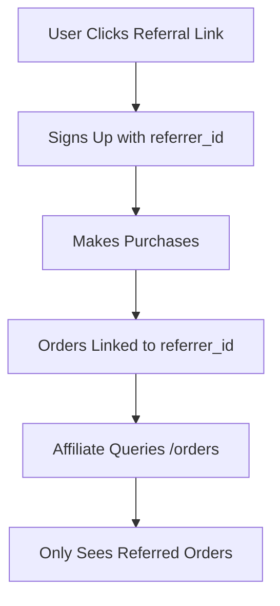

Fetch the complete documentation index at: https://docs.bitrefill.com/llms.txt. Use this file to discover all available pages before exploring further. Append .md to any documentation page URL to get its markdown version.

# Track Referrals

Understand how referral filtering works in the Affiliate API.

When you use the Affiliate API, orders and invoices are automatically filtered to show only activity from users you referred.

## How Referral Filtering Works

When users sign up through your referral link, they're associated with your `referrer_id`. When you query orders or invoices, the API automatically filters by this ID.



## Business API vs Affiliate API Filtering

| Endpoint           | Business API          | Affiliate API             |
| ------------------ | --------------------- | ------------------------- |
| `GET /orders`      | Filtered by `user_id` | Filtered by `referrer_id` |
| `GET /invoices`    | Filtered by `user_id` | Filtered by `referrer_id` |
| `GET /commissions` | Not available         | Your commissions          |

## Querying Referred Orders

```javascript
const response = await fetch(`${BASE_URL}/orders`, { headers });
const { data: orders } = await response.json();

// These are orders from users you referred
orders.forEach(order => {
  console.log(`${order.id}: ${order.product.name} - ${order.status}`);
});
```

## Filtering by Date

```javascript
const startDate = '2024-01-01';
const endDate = '2024-02-01';

const response = await fetch(
  `${BASE_URL}/orders?after=${startDate}&before=${endDate}`,
  { headers }
);
```

Query parameters:

* `after` — Start date (inclusive), ISO format
* `before` — End date (exclusive), ISO format

## Pagination

Orders are paginated. Use `start` and `limit` to navigate:

```javascript
async function getAllOrders() {
  const orders = [];
  let url = `${BASE_URL}/orders?limit=50`;
  
  while (url) {
    const response = await fetch(url, { headers });
    const data = await response.json();
    orders.push(...data.data);
    url = data.meta._next || null;
  }
  
  return orders;
}
```

## Understanding the Data

### What You Can See

As an affiliate, you can see:

* Order IDs and statuses
* Products purchased (ID, name, value)
* Payment amounts
* Timestamps

### What You Cannot See

For privacy, you cannot see:

* End user personal information
* Redemption codes/gift card details
* User email addresses
* Specific payment details (crypto addresses, etc.)

## Building a Referral Dashboard

```javascript
async function getMonthlyStats(year, month) {
  const startDate = new Date(year, month - 1, 1).toISOString().split('T')[0];
  const endDate = new Date(year, month, 1).toISOString().split('T')[0];
  
  // Fetch all orders for the month
  const orders = [];
  let url = `${BASE_URL}/orders?after=${startDate}&before=${endDate}&limit=50`;
  
  while (url) {
    const response = await fetch(url, { headers });
    const data = await response.json();
    orders.push(...data.data);
    url = data.meta._next;
  }
  
  const deliveredOrders = orders.filter(o => o.status === 'delivered');
  const totalValue = deliveredOrders.reduce((sum, o) => sum + o.product.value, 0);
  
  return {
    period: `${year}-${month.toString().padStart(2, '0')}`,
    totalOrders: orders.length,
    deliveredOrders: deliveredOrders.length,
    totalValue
  };
}
```

## Linking Commissions to Orders

Each commission is linked to an order. Use the `order_id` to correlate:

```javascript
async function getOrderWithCommission(orderId) {
  const orderRes = await fetch(`${BASE_URL}/orders/${orderId}`, { headers });
  const { data: order } = await orderRes.json();
  
  const commissionsRes = await fetch(`${BASE_URL}/commissions`, { headers });
  const { data: commissions } = await commissionsRes.json();
  
  const commission = commissions.find(c => c.order.id === orderId);
  
  return { order, commission };
}
```